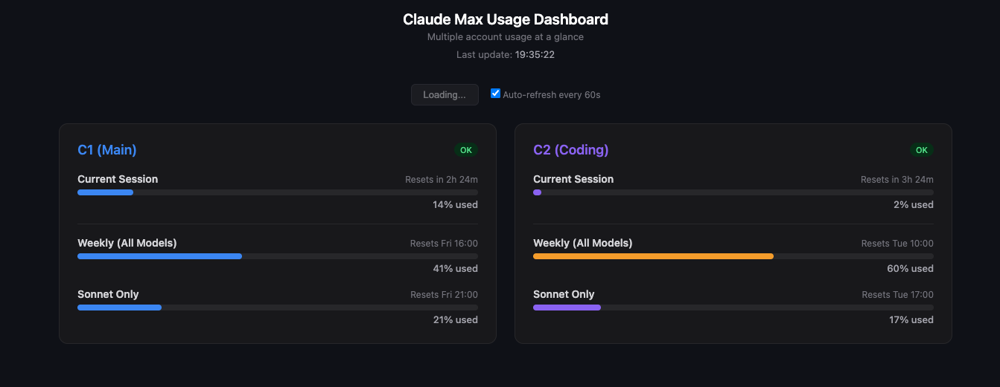

# Claude Max Usage Dashboard

Claude Maxの使用量を複数アカウントでリアルタイムに並べて確認するダッシュボード。

Monitor Claude Max usage across multiple accounts in real time.



## 何ができるか / What It Does

Claude Maxを2アカウント以上で運用している人向け。セッション残量・週間使用率・Sonnet消費率をひと目で比較できる。

For users running 2+ Claude Max accounts. Compare session remaining, weekly usage, and Sonnet consumption at a glance.

- セッション（5時間）使用率 / Session (5h) utilization
- 週間使用率（全モデル） / Weekly usage (all models)
- Sonnetのみの使用率 / Sonnet-only usage
- リセットまでのカウントダウン / Reset countdown
- 60秒ごとの自動更新 / Auto-refresh every 60s
- 依存パッケージなし、Node.jsだけで動く / Zero dependencies, just Node.js
- localhost限定 + CSRF保護 / localhost-only + CSRF protection

---

## セットアップ / Setup

```bash
git clone https://github.com/Takao-Mochizuki/claude-max-usage-dashboard.git
cd claude-max-usage-dashboard
cp .env.example .env
```

`.env` を編集してトークンを入力 / Edit `.env` with your tokens:

```env
C1_TOKEN=sk-ant-oat01-xxxxx
C1_LABEL=Main
C2_TOKEN=sk-ant-oat01-yyyyy
C2_LABEL=Coding
```

起動 / Start:

```bash
node server.mjs
```

ブラウザで `http://localhost:18800` を開く / Open `http://localhost:18800`

---

## トークンの取得方法 / How to Get Your Token

### 前提条件 / Prerequisites
- [Claude Code](https://docs.anthropic.com/en/docs/claude-code) がインストール済み
- Claude Max（月$200）にログイン済み

### 手順 / Steps

1. ターミナルを開く / Open terminal

2. 以下を実行 / Run:
```bash
claude setup-token
```

3. 表示されるトークンをコピー（`sk-ant-oat01-` で始まる）
   Copy the token (starts with `sk-ant-oat01-`)

4. `.env` の `C1_TOKEN` に貼り付け / Paste into `C1_TOKEN` in `.env`

5. 2つ目のアカウントがあれば、そちらでもログインして同じ手順を繰り返す
   For a second account, log in and repeat

### トークンの有効期限 / Token Expiry

`setup-token` のトークンは有効期限がある。認証エラーが出たら再取得する：

Tokens from `setup-token` can expire. If you see auth errors, regenerate:

```bash
claude setup-token
```

---

## 仕組み / How It Works

各アカウントのトークンで最小限のAPIコール（出力1トークン）を実行し、レスポンスヘッダーから使用量を取得する。

Makes a minimal API call (1 output token) per account and reads rate limit headers:

| ヘッダー / Header | 内容 / Description |
|---|---|
| `anthropic-ratelimit-unified-5h-utilization` | セッション使用率 / Session usage |
| `anthropic-ratelimit-unified-7d-utilization` | 週間使用率（全モデル）/ Weekly (all models) |
| `anthropic-ratelimit-unified-7d_sonnet-utilization` | Sonnetのみ / Sonnet only |

1回の更新で消費するのはアカウントあたり約10トークン。使用量への影響はほぼゼロ。

Each refresh costs ~10 tokens per account — negligible impact on quota.

---

## セキュリティ：1Passwordの利用を推奨 / Security: 1Password Recommended

**`.env` ファイルは絶対にコミットしない。** トークンが含まれている。

**Never commit `.env`.** It contains your Claude Max OAuth tokens.

[1Password](https://amzn.to/4lqvyxf) を使えばトークンを平文でディスクに置かずに済む：

Use [1Password](https://amzn.to/4lqvyxf) to avoid storing tokens in plain text:

```env
# .env（Secret Referenceのみ、コミットしても安全）
# .env (only references — safe to commit)
C1_TOKEN=op://Private/Claude Token C1/credential
C2_TOKEN=op://Private/Claude Token C2/credential
```

```bash
# 1Password CLIでトークンを注入して起動
# Inject tokens via 1Password CLI
op run --env-file=.env -- node server.mjs
```

---

## 応用例 / Use Cases

### 1. 2アカウント運用の残量管理 / Managing 2-Account Setup

Claude Maxを2つ契約し、リセット日をずらして運用する場合（例：C1=金曜リセット、C2=火曜リセット）、どちらに余裕があるかをダッシュボードで即座に判断できる。

If you stagger reset days (e.g. C1=Friday, C2=Tuesday), the dashboard instantly shows which account has more headroom.

### 2. OpenClawとの併用 / With OpenClaw

[OpenClaw](https://github.com/openclaw/openclaw) のバックエンドをClaude Maxで動かしている場合、トークン切り替えの判断材料になる。枠が逼迫した方から余裕がある方へ切り替える。

When running OpenClaw on Claude Max, use the dashboard to decide when to switch tokens between accounts.

### 3. チーム内の使用量の可視化 / Team Usage Visibility

チームメンバーがそれぞれClaude Maxアカウントを持っている場合、最大9アカウントまで同時に監視できる。

Monitor up to 9 accounts simultaneously for team-wide visibility.

### 4. SaaS開発時のコスト管理 / Cost Management for SaaS Development

`setup-token` 方式でClaude APIをSaaSに組み込んでいる場合、開発中の使用量がサブスクの枠にどれだけ影響しているかをリアルタイムで確認できる。

Track how your SaaS development API calls impact your subscription quota in real time.

---

## セキュリティ設計 / Security Design

このダッシュボードは以下の保護を実装している：

This dashboard implements the following protections:

- **localhost限定**: `127.0.0.1` にのみバインド。LAN上の他デバイスからアクセス不可
  Binds to `127.0.0.1` only. Not accessible from other devices on the network.
- **POST + CSRFトークン**: `/api/usage` はPOSTのみ受け付け（GETは405）、サーバー起動時に生成されるランダムトークンを `x-dashboard-csrf` ヘッダーで検証。外部サイトからの不正呼び出しを防止
  `/api/usage` accepts POST only (GET returns 405) with a per-session CSRF token in `x-dashboard-csrf` header. Prevents cross-origin abuse.
- **Origin + Host 二重検証**: Origin・Hostヘッダーを `new URL()` でパースし、localhostでない場合はリクエストを拒否（403）
  Both Origin and Host headers are parsed via `new URL()` and rejected if not localhost.
- **innerHTML排除**: 動的コンテンツは全てDOM API（`createElement` / `textContent`）で構築。innerHTML経由のXSSシンクなし
  All dynamic content rendered via DOM API (`createElement`/`textContent`). Zero innerHTML usage for user data.
- **orgId非公開**: AnthropicのOrganization IDは収集・返却しない
  Anthropic Organization ID is neither collected nor returned.
- **エラーサニタイズ**: APIエラーのレスポンス本文を返さない（トークン漏洩防止）
  Raw API error bodies are never returned to the client.
- **30秒キャッシュ**: 同一データへの連続リクエストはキャッシュから返却。不要なAPI消費を防止
  30-second server-side cache prevents redundant API calls on rapid refreshes.

---

## 設定 / Configuration

| 環境変数 / Env Var | 説明 / Description | 必須 / Required |
|---|---|---|
| `C1_TOKEN` | アカウント1のトークン / Account 1 token | Yes |
| `C1_LABEL` | アカウント1の表示名 / Account 1 label | No (default: `C1`) |
| `C2_TOKEN` ~ `C9_TOKEN` | 追加アカウント / Additional accounts | No |
| `PORT` | サーバーポート / Server port | No (default: `18800`) |

---

## License

MIT
